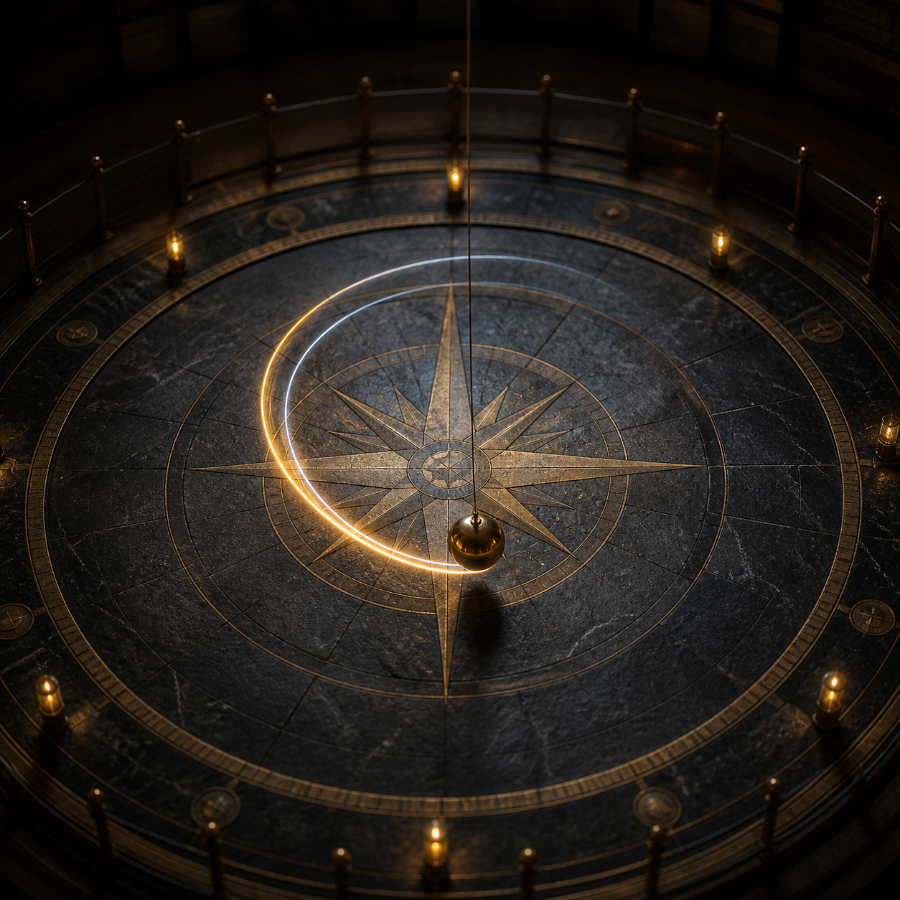

# 2026-08-14 Foucault

  

Same prompt. Gemini 3.7 Flash High vs Grok 4.6 Extra High. One paste each.

- Gemini: [gemini-3.7-flash-high/index.html](gemini-3.7-flash-high/index.html)
- Grok: [grok-4.6-xhigh/foucault.html](grok-4.6-xhigh/foucault.html)
- Prompt: [prompt.md](prompt.md)

Filmed later as `gem37high.mp4` / `grok46xhigh.mp4` (not in this repo).

On the tape: Flash High stayed at 90°N, 6°/s, 42/48 pins. Grok Extra High was dragged to 0° and printed 0°/day, full turn none.

Generation chats (paths stripped):
- [chats/gemini-3.7-flash-high.md](chats/gemini-3.7-flash-high.md) — `/export-convo` full transcript
- [chats/grok-4.6-xhigh.md](chats/grok-4.6-xhigh.md) — Grok export (tools, no thinking dump)
