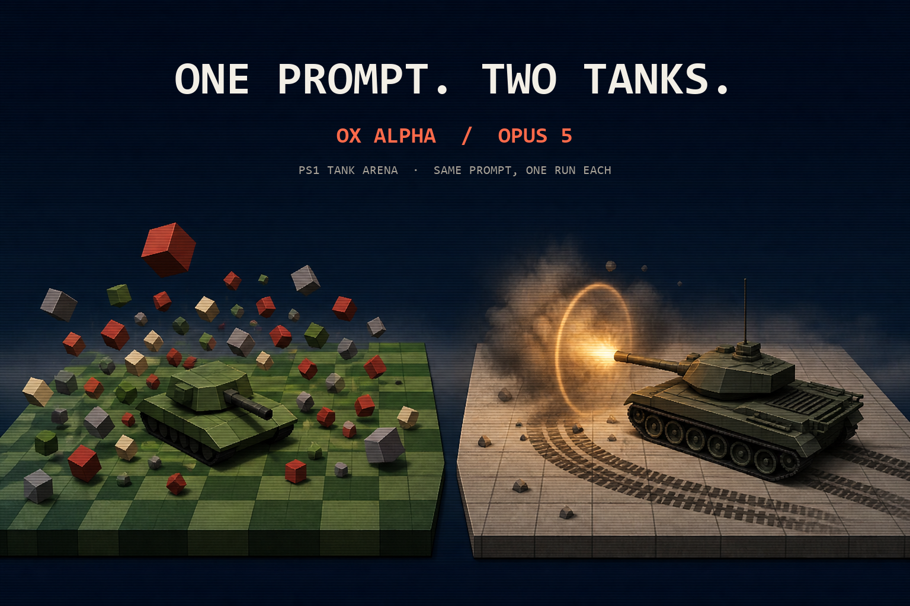

# 2026-08-21 PS1 Tank Arena

  

Same prompt. Ox Alpha vs Opus 5. One paste each.

- Ox Alpha: [ox-alpha/index.html](ox-alpha/index.html)
- Opus 5: [opus-5/index.html](opus-5/index.html)
- Exact prompt: [prompt.md](prompt.md)

The videos stay on X and are not included here.

## What showed up on screen

**Ox Alpha** made the busier toy. Its compact arena, fast firing, and dense voxel field kept blocks tumbling. On the recorded run, the HUD reached 50 blocks from 28 shots.

**Opus 5** made the more deliberate tank. It added a reload cycle, throttle and reload gauges, persistent tread marks, full-scene muzzle lighting, hit confirmation, and an impact shockwave.

Short version: Ox Alpha made the more immediately playable demolition toy. Opus 5 made the more convincing tank.

## Generation chats

Not included yet. No generation-chat exports were present beside these runs. The HTML files above are byte-identical copies of the recorded outputs; local paths, CommandCode settings, operator notes, and alternate attempts were excluded.
