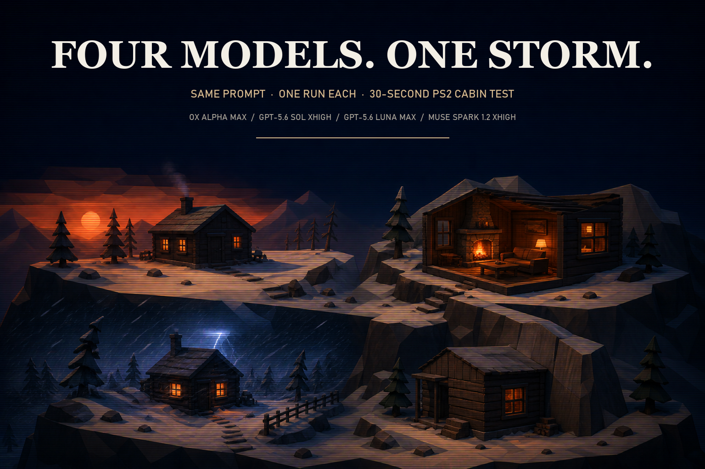

# 2026-08-23 Mountain Cabin Storm

  

One prompt, four models, one self-contained HTML file each.

- Ox Alpha Max: [ox-alpha-max/index.html](ox-alpha-max/index.html)
- GPT-5.6 Sol xhigh: [gpt-5.6-sol-xhigh/index.html](gpt-5.6-sol-xhigh/index.html)
- GPT-5.6 Luna Max: [gpt-5.6-luna-max/index.html](gpt-5.6-luna-max/index.html)
- Muse Spark 1.2 xhigh: [muse-spark-1.2-xhigh/index.html](muse-spark-1.2-xhigh/index.html)
- Exact prompt: [prompt.md](prompt.md)

The 2×2 recording stays on X and is not included here.

## What showed up on screen

**GPT-5.6 Sol xhigh** made the strongest complete cinematic in this run. It moved from a readable exterior into a furnished cabin with a fireplace, then returned outside for the storm.

**Ox Alpha Max** made a strong exterior and a clear sunset-to-blizzard change. Its interior camera spent part of the run blocked by cabin geometry.

**GPT-5.6 Luna Max** built a simpler cabin but completed the exterior, interior, night storm, and loop. Its brief dark section was part of the authored transition.

**Muse Spark 1.2 xhigh** had the weakest camera. It spent roughly two seconds facing a dark cabin wall before moving back outside.

Short version: Sol won this run for me.

## Provenance

Abhinav supplied the same Mountain Cabin prompt manually to all four runs. Ox Alpha and Muse retained clean-workspace input manifests with the same 1,415-byte prompt and SHA-256 `64d8594277c347a1ce96eb3dca1146054514f8e2d50c78abb6d294a29ed80f99`.

The two GPT workspaces did not retain a prompt file, so Rook could not independently hash their prompt input after the run. Their model labels and effort settings come from the operator's run record.

The HTML files here are byte-identical copies of the saved model outputs. Videos, local paths, operator notes, browser profiles, and recording artifacts were excluded.

## Generation chats

Not included. No clean generation-chat exports were present beside these four outputs.
