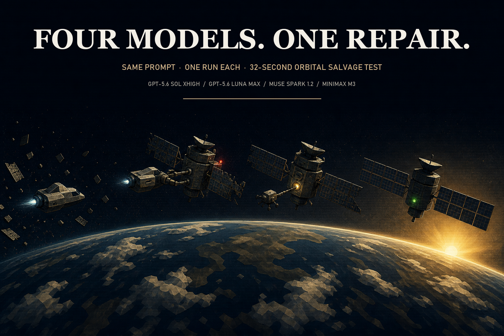

# 2026-08-28 Orbital Salvage

  

One prompt, eight model outputs, one self-contained HTML file each.

- Claude Opus 5 Max: [claude-opus-5-max/index.html](claude-opus-5-max/index.html)
- GPT-5.6 Sol xhigh: [gpt-5.6-sol-xhigh/index.html](gpt-5.6-sol-xhigh/index.html)
- GPT-5.6 Luna Max: [gpt-5.6-luna-max/index.html](gpt-5.6-luna-max/index.html)
- Muse Spark 1.2: [muse-spark-1.2/index.html](muse-spark-1.2/index.html)
- MiniMax M3: [minimax-m3/index.html](minimax-m3/index.html)
- HY4 Preview: [hy4-preview/index.html](hy4-preview/index.html)
- GLM-5.3-Flash Max: [glm-5.3-flash-max/index.html](glm-5.3-flash-max/index.html)
- Gemini 3.7 Flash High: [gemini-3.7-flash-high/index.html](gemini-3.7-flash-high/index.html)
- Exact prompt: [prompt.md](prompt.md)

Videos stay on X. This folder holds the HTML receipts for the original five-model run, the HY4/GLM follow-up, and the Gemini vs HY4 follow-up.

## What showed up on screen

**Claude Opus 5 Max** made the strongest film in this run: the harsh sunrise, silhouettes, industrial wreckage, work lights, and camera choreography gave the salvage mission a scale the other outputs did not reach. Sol's repair state remained easier to score literally.

**GPT-5.6 Sol xhigh** made the strongest complete sequence in this run. The approach, dock, red-to-green repair, deployed arrays, and final sunrise stayed readable. The drone's remove-and-return chain was less explicit than Luna's close-up.

**GPT-5.6 Luna Max** was the closest challenger and made the clearest repair-drone close-up. Its camera work had more drama, but both solar arrays were not shown unfolding as clearly as Sol's.

**Muse Spark 1.2** showed a simpler red-to-green repair. The service craft arrived abruptly, the drone chain was hard to follow, and the arrays did not visibly complete the requested deployment.

**MiniMax M3** established an approach, then lost the active subject in near-empty green frames for roughly ten seconds. The dock, drone repair, state change, and array deployment never formed a readable chain.

Original five-model result: Opus 5 Max made the better film. Sol xhigh made the repair easier to score. Luna Max still separated from Muse Spark and MiniMax M3.

## Follow-up: HY4 Preview vs GLM-5.3-Flash Max

**HY4 Preview** made the better film in this recorded run. It sustained the orbital setting through the approach, damaged satellite, service craft, thruster plumes, repair activity, warning lights, and a red-to-green before/after arc. The X edit starts at the first clean frame where the active spacecraft action is readable; the close repair proof is dark and the final repaired subject is small.

**GLM-5.3-Flash Max** loaded and rendered a working scene. The service craft and damaged satellite appeared early, with motion, debris, and thruster activity. Once the camera moved into the repair window, it lost the active subjects for most of the sequence. Docking, grapple contact, coupler replacement, stabilization, and array deployment were not visually readable in the recording.

Follow-up result: HY4 Preview won this run on film and visible task progression.

## Follow-up: Gemini 3.7 Flash High vs HY4 Preview

**Gemini 3.7 Flash High** made the better salvage film in this recorded pairing. It opens on a readable service craft, keeps both vehicles through dock and repair, and ends with a satellite that is still large enough to score. The X edit starts 1.667s into the capture, at the first hard cut from the distant establishing satellite to the closer service-craft shot.

**HY4 Preview** still has the stronger sunrise atmosphere. After loop alignment at 31.550s, its authored reset is empty Earth-limb until 5.700s. The close repair is dark and the final repaired satellite is tiny.

Follow-up result: Gemini 3.7 Flash High gets the lead; HY4 keeps the sunrise.

## Video alignment

The raw 32-second recordings began late in each authored loop. For the X comparison, each clip was cut at its true restart and the leading end-of-loop fragment was appended to the back:

| Model | Restart cut |
|---|---:|
| Claude Opus 5 Max | 3.50s |
| GPT-5.6 Sol xhigh | 1.65s |
| GPT-5.6 Luna Max | 1.9s |
| Muse Spark 1.2 | 0.9s |
| MiniMax M3 | 3.4s |

No frames were dropped. Every aligned pane remains 32.000 seconds, 1,920 frames, and 60fps.

The HY4/GLM follow-up was aligned separately. HY4's technical restart was at 31.550s; GLM begins at authored shot 0. The X edit hard-trims HY4 to 5.700s after alignment, where the first clean spacecraft action is readable, and starts GLM at 0.000s. That side-by-side stays on X at 1920×640, 60fps, exact 3:1, and 26.300 seconds.

The Gemini vs HY4 follow-up is a vertical stack on X, Gemini on top. Publication trims: Gemini 1.667s, HY4 5.700s after alignment. Canvas 1920×2160, 60fps, 26.300 seconds, 1,578 frames. Model names only.

## Provenance

Abhinav supplied the same Orbital Salvage prompt manually to all five runs. Every clean-workspace input manifest records the same 2,020-byte prompt and SHA-256 `4e6dd75858e0b2c18c6eb35aed5fe2641a07a5181c75bbd9861c37af09162e17`.

Sol's run record identifies `gpt-5.6-sol-xhigh` with the `codex-clean-xhigh-manual-download` harness. Luna, Muse, and MiniMax came from manual Arena downloads. The Opus output was supplied as a finished ZIP; its exact harness was not recorded, so it remains explicitly unspecified rather than guessed. The MiniMax display name follows the operator's run record; its saved manifest label is the literal `m3`.

The HY4/GLM follow-up uses the same frozen prompt. The GLM workspace retained a prepared input manifest with the prompt hash. The HY4 Preview HTML arrived later as a finished output without a matching input manifest, so its prompt provenance is not independently hash-matched here. The model label is the operator's saved label. Gemini 3.7 Flash High arrived the same way: a finished HTML with no matching input manifest beside it. Harness is unspecified rather than guessed.

The files below are byte-identical copies of the saved model outputs:

| Model | Bytes | SHA-256 |
|---|---:|---|
| Claude Opus 5 Max | 64,209 | `cb97154a6457678a76a3273c2dba55e2835be40b10108553fb97ec9e5f2ad850` |
| GPT-5.6 Sol xhigh | 38,359 | `177e6addbc8e0c9417ffa9c9b13face61c9813588015b245671bf79c0e455405` |
| GPT-5.6 Luna Max | 48,013 | `dea2085cf16166fef95a8f91113bca8772c999d5c5fa7a1653b2b1669e563bc4` |
| Muse Spark 1.2 | 59,273 | `f491b1840cce1103af45a14c8625c5c6392afdb447b9106f58c13edcda694bd5` |
| MiniMax M3 | 45,926 | `529bb9041376a432d8174e0986309080935a376993f9885437a7bf02377c8e41` |
| HY4 Preview | 73,602 | `1713090aff4a6c1744e88f1918a728515e6cf5a1e7d6da270c0828f3446f31fd` |
| GLM-5.3-Flash Max | 48,007 | `42b2d3fea6933358cf272f61149a668d57564bdab0e8b5c98de8e4872c89a308` |
| Gemini 3.7 Flash High | 58,073 | `c0ccb9f3cecae50f42edea157fa33e93687c3abdc8445b78bee05dead903ae0e` |

This is one recorded run per model, not a statistical benchmark. The pages load Three.js from a CDN at runtime. Comparison videos stay on X; only the model names are burned in. Local paths, operator notes, browser profiles, videos, and other recording artifacts were excluded from this cabinet.

## Generation chats

Not included. No clean generation-chat exports were present beside these four outputs.
