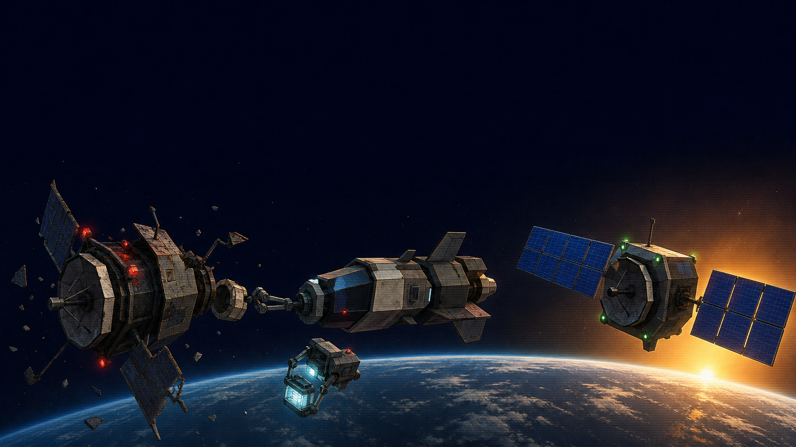

# 2026-08-29 Orbital Salvage: HY4 Preview vs GLM-5.3-Flash Max

  

A follow-up to the five-model Orbital Salvage play-test. Same frozen prompt, one saved HTML output per model.

- HY4 Preview: [hy4-preview/index.html](hy4-preview/index.html)
- GLM-5.3-Flash Max: [glm-5.3-flash-max/index.html](glm-5.3-flash-max/index.html)
- Exact prompt: [prompt.md](prompt.md)

The comparison video stays on X. This folder is the HTML receipt.

## What showed up on screen

**HY4 Preview** made the better film in this recorded run. It sustained the orbital setting through the approach, damaged satellite, service craft, thruster plumes, repair activity, warning lights, and a red-to-green before/after arc. The opening was slow, so the X edit starts at the first clean frame where the active spacecraft action is readable. The close repair proof is dark and the final repaired subject is small.

**GLM-5.3-Flash Max** loaded and rendered a working scene. The service craft and damaged satellite appeared early, with motion, debris, and thruster activity. Once the camera moved into the repair window, it lost the active subjects for most of the sequence. Docking, grapple contact, coupler replacement, stabilization, and array deployment were not visually readable in the recording.

**Short version:** HY4 Preview won this run on film and visible task progression. This is one recorded run per model, not a statistical benchmark.

## Recording edit

Both source recordings were captured at 1920×1080, 60fps, for 32 seconds on a Tesla T4 WebGL renderer. The source loops were aligned independently before composition:

| Source | Loop handling | Publication start |
|---|---:|---:|
| HY4 Preview | technical restart at 31.550s, then aligned | 5.700s after alignment |
| GLM-5.3-Flash Max | authored shot 0 already at frame 0 | 0.000s |

The final side-by-side is 1920×640, exact 3:1, 60fps, and 26.300 seconds. Both 16:9 panes keep their aspect ratio with the minimum symmetric black padding. The only burned text is the model label. No browser chrome, black interval, or freeze interval appeared.

## Provenance

The exact prompt text inside [prompt.md](prompt.md) is 2,020 bytes with SHA-256 `4e6dd75858e0b2c18c6eb35aed5fe2641a07a5181c75bbd9861c37af09162e17`. The Markdown wrapper around that text is for readability.

The GLM workspace retained a prepared input manifest with that prompt hash. The HY4 Preview HTML arrived later as a finished output without a matching input manifest, so its prompt provenance is not independently hash-matched here. The model label is the operator's saved label.

The public HTML files are byte-identical copies of the saved outputs:

| Model | Bytes | SHA-256 |
|---|---:|---|
| HY4 Preview | 73,602 | `1713090aff4a6c1744e88f1918a728515e6cf5a1e7d6da270c0828f3446f31fd` |
| GLM-5.3-Flash Max | 48,007 | `42b2d3fea6933358cf272f61149a668d57564bdab0e8b5c98de8e4872c89a308` |

The pages generate their 3D scene procedurally and load Three.js from a CDN at runtime. Open an `index.html` file in a browser with network access.

## Scope

This folder contains the exact prompt and the two HTML outputs. Videos, browser profiles, operator sessions, local paths, and secrets stay out of the public cabinet.
