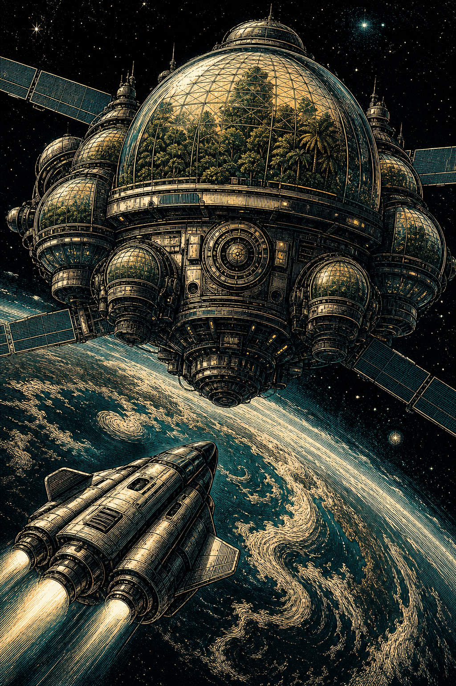

# Eden Ark Revival — Gemini 3.7 Flash High vs Gemini 3.0 Flash

A side-by-side generational taste evaluation of Google's frontier lightweight models across 9 months on an identical, unassisted 48-second cinematic Three.js prompt.

## Evaluation Protocol
- **Prompt:** `PROMPT.md` (Identical 48-second cinematic Three.js prompt, zero build step, procedural geometry and shaders).
- **Format:** Single self-contained `index.html` executed in vanilla Chrome on an NVIDIA Tesla T4.
- **Comparison:** Vertical portrait stack (Top: Gemini 3.7 Flash High / Bottom: Gemini 3.0 Flash Dec 2025).

## Outputs
- `gemini-3.7-flash-high/index.html`: Authored modular habitat structure, progressive ignition sequence, bioluminescent terraced garden biomes, and procedural particle field.
- `gemini-3-flash/index.html`: Baseline geometric rescue vessel flyby, custom atmospheric shader, and solar petal unfolding.

## Provenance
- Evaluated on September 2, 2026.
- Comparison video published to X [@beyondwudan](https://x.com/beyondwudan).
