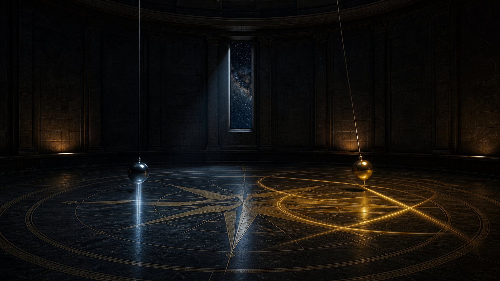

# evals

<p align="center">
  
</p>

Same prompt. Multiple models. The HTML they wrote. Generation chats when the tool exported them.

Play-tests from [@beyondwudan](https://x.com/beyondwudan). One run each. Not a bench.

Open a folder, download the page, run it locally.

## Runs

| Date | Pair | Folder |
|------|------|--------|
| 2026-08-23 | Mountain Cabin four-way | [2026-08-23-mountain-cabin-storm](2026-08-23-mountain-cabin-storm) |
| 2026-08-21 | Ox Alpha vs Opus 5 | [2026-08-21-ps1-tank](2026-08-21-ps1-tank) |
| 2026-08-14 | Gemini 3.7 Flash High vs Grok 4.6 Extra High | [2026-08-14-foucault](2026-08-14-foucault) |

On that tape: Flash High stayed at 90°N (6°/s, 42/48 pins). Grok Extra High was dragged to 0° and printed `0°/day`, full turn none.

On the tank tape: Ox Alpha made the faster demolition toy. Opus 5 made the more convincing tank, with a reload cycle, tread marks, full-scene muzzle lighting, and an impact shockwave.

On the Mountain Cabin tape: GPT-5.6 Sol xhigh completed the hardest camera move, from the snowfield through the window into a furnished cabin. Ox Alpha Max built a strong exterior but clipped the interior camera. Muse stared at a dark wall for roughly two seconds.

## Layout

```
YYYY-MM-DD-name/
  README.md       pair, date, what showed up on screen
  prompt.md       the exact paste
  <model>/        playable HTML
  chats/          generation exports when available
```

Videos stay on X. This repo is the receipt.

## What is not here

Operator sessions. Tokens. Local paths. Scrapers.

When included, generation chats are stripped of machine paths before they land.

## License

MIT. See [LICENSE](LICENSE).
